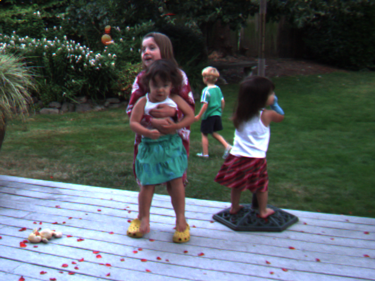
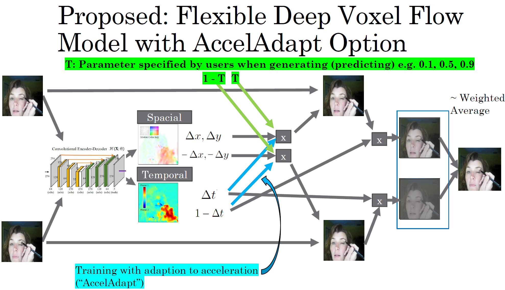
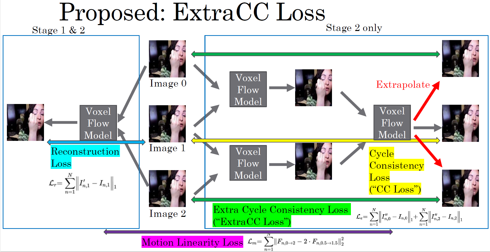

# Refactored and enhanced version of [CyclicGen](https://github.com/alex04072000/CyclicGen) and [voxle-flow](https://github.com/liuziwei7/voxel-flow)

Input Image  --->
 
 
|
 <--- Input Image

	frame rate x10 demo (9 interpolated frames between 2 input images) 

## Required files (too big to upload to GitHub)
Download vgg16.npy (pretrained vgg16 weights file) and hed_model from
 https://github.com/alex04072000/CyclicGen/blob/master/README.md >> "ckpt_and_hed_model" >> https://drive.google.com/file/d/1X7PWDY2nAx8ZeSLso5qeypRUCDokNFms/view

## [0] Python code to prepare data (No need to run)
### Code to extract image frames from AVI files in UCF101 dataset
UCF101_extractor.py
>> - Output ./UCF-101_frames256/ (The data in this folder is provided separately.)

### Generate frame path list for training used for the main code in ./data_list/.
generate_frame_list.ipynb
>> - Output ./data_list/

## [1] Main Python code to train the model and generate image frames (run in Linux with GPU)

CyclicGen_main.py
>> - Input ./UCF-101_frames256/ ./data_list/ ./hed_model/
>> - Output ./train_dir/ ./ucf101_interp_ours/ ./Middlebury/

## [2] Python code to compute SSIM, PSNR, and MS-SSIM for output data (run in Linux)

ucf101_interp_evaluation.py
>> - Input  ./ucf101_interp_ours/ (source: https://github.com/liuziwei7/voxel-flow >> "Testing Data")
>> - Output ./ucf101_interp_ours/

## [3] Python code to join model parameters (run in Windows)
ucf101_interp_evaluation2_.py
>> - Input ./ucf101_interp_ours/ ./train_dir/model_param_lookup.csv
>> - Output ./ucf101_interp_ours/

## [4] Tableau workbook to generate final report (run in Windows)
./ucf101_interp_ours/CNN-based_Frame_Interpolation_Evaluation.twb

