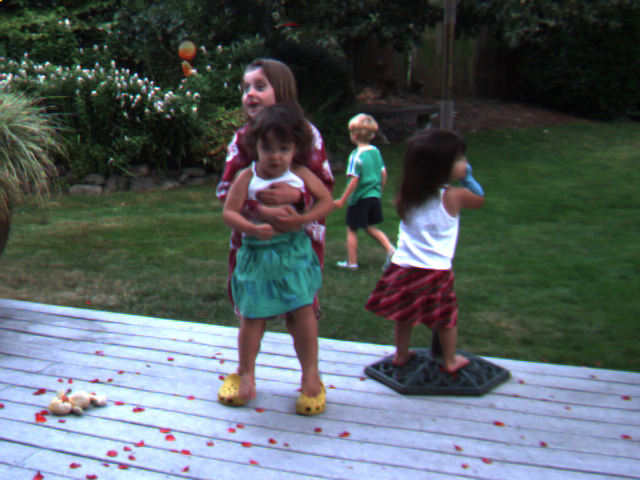
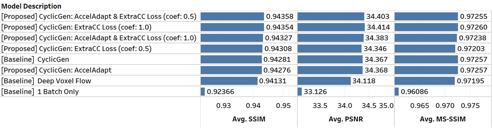

# Refactored and enhanced version of [CyclicGen](https://github.com/alex04072000/CyclicGen) and [voxel-flow](https://github.com/liuziwei7/voxel-flow)


Input Image  --->
 
 
|
 <--- Input Image
<p align="center">
	frame rate x10 demo (9 interpolated frames between 2 input images) 
</p>


<p align="center">

</p>

<p align="center">

</p>

<p align="center">

</p>

## Required files (too big to upload to GitHub)
Download vgg16.npy (pretrained vgg16 weights file) and hed_model from
 [[CyclicGen]](https://github.com/alex04072000/CyclicGen/blob/master/README.md) >> "ckpt_and_hed_model" >> [Google drive](https://drive.google.com/file/d/1X7PWDY2nAx8ZeSLso5qeypRUCDokNFms/view)
 
## Environemnt
- Linux with CUDA/GPU
- Python 3 (3.5 or later required)
- TensorFlow 1.13


## [0] Python code to prepare data
### Code to extract image frames from AVI files in [[UCF101]](https://www.crcv.ucf.edu/data/UCF101.php) dataset
[[CF101_extractor.py]](https://github.com/Minyus/CyclicGen/blob/master/UCF101_extractor.py)
> - Input ./UCF-101/ (source: unzipped [[UCF101.rar]](https://www.crcv.ucf.edu/data/UCF101/UCF101.rar))
> - Output ./UCF-101_frames256/ (The data in this folder is provided separately.)
> - Extract every 5 frames (0.2 seconds interval) from all AVI videos and resize to 256 x 256


### Generate frame path list for training used for the main code.
[[generate_frame_list.ipynb]](https://github.com/Minyus/CyclicGen/blob/master/generate_frame_list.ipynb)
> - Input ./ucf101_train_test_split/ (source: [[vodel_flow]](https://github.com/liuziwei7/voxel-flow/blob/master/README.md) >> "Train/Test Split" >> [[Google drive]](https://drive.google.com/file/d/1rwnTfzCEIMFv6xiBGCpSnCUvMufJXdkU/view)) 
> - Output ./data_list/
> - Generate 3 text files that include the PNG image file paths (triplet: 2 input images and the ground truth between them)

## [1] Main Python code to train the model and generate image frames (run in Linux with GPU)

[[CyclicGen_main.py]](https://github.com/Minyus/CyclicGen/blob/master/CyclicGen_main.py)
> - Input ./UCF-101_frames256/ ./data_list/ ./hed_model/
> - Output ./train_dir/ ./ucf101_interp_ours/ ./Middlebury/
> - Training (Stage 1 and/or Stage 2) and Testing (Generating interpolated images)
> - Example command: 
> 		``` python3 CyclicGen_main.py --strategy=accel_adjust --coef_loss_e=0.5 --max_epochs=10 --s1_epochs=5 ```

## [2] Python code to compute SSIM, PSNR, and MS-SSIM (average of 3 values for RGB channels) for output data (run in Linux)

[[ucf101_interp_evaluation.py]](https://github.com/Minyus/CyclicGen/blob/master/ucf101_interp_evaluation.py)
> - Input  ./ucf101_interp_ours/ (source: [[vodel_flow]](https://github.com/liuziwei7/voxel-flow/blob/master/README.md) >> "Testing Data" >> [[Google Drive]](https://drive.google.com/file/d/0B7EVK8r0v71pdHBNdXB6TE1wSTQ/view))
> - Output ./ucf101_interp_ours/

## [3] Python code to join model parameters (run in Windows)
[[ucf101_interp_evaluation2_.py]](https://github.com/Minyus/CyclicGen/blob/master/ucf101_interp_evaluation2_.py)
> - Input ./ucf101_interp_ours/ ./train_dir/model_param_lookup.csv
> - Output ./ucf101_interp_ours/

## [4] Tableau workbook to generate final report (run in Windows)
[[CNN-based_Frame_Interpolation_Evaluation.twb]](https://github.com/Minyus/CyclicGen/blob/master/ucf101_interp_ours/CNN-based_Frame_Interpolation_Evaluation.twb)

